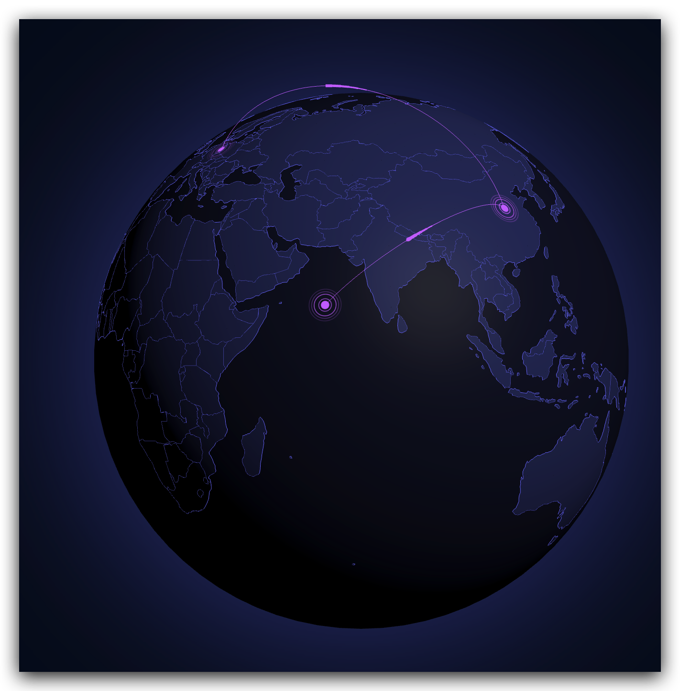

# earthFlyLine

## [项目地址](#https://github.com/JavaScriptam/earth-flyLine)
https://github.com/JavaScriptam/earth-flyLine

## 项目介绍

基于three.js 构建3D大屏地球可视化，居家必备，搬砖神器节约时间。

## ✨ 特性

+ 📦 开箱即用：简单快速集成，基本零成本上手。
+ 🛡 Typescript开发：提供完整的类型定义文件。

## 目录

- [使用说明](#使用说明)
  - [示例](#-示例)
- [文档](#-文档)
- [本地构建](#-本地构建)


# 使用说明

```bash
npm install earth-flyline -S
```


## 🐸 示例

```javascript
import earthFlyLine from "earth-flyline";
//请先下载地图文件（可去第三方下载） 然后注册地图 本项目的地图文件在src/map/world
import geojson from 'xxx/path/world.json'
earthFlyLine.registerMap("world", geojson);
//获取dom节点作为容器 注：该节点请设置宽高
const dom = document.getElementById("container");
const chart = earthFlyLine.init({
      dom,
      map: "world",
    });
//新增数据
chart.addData("flyLine", [
 {
   from:{
     id:1,//string | number
      lon: 112.45, //经度
      lat: 34.62, //维度
     ...extraField // 其他自定义字段
    },
    to:{
      id:2,//string | number
      lon: 14, //经度
      lat: 52, //维度
      ...extraField // 其他自定义字段
    },
 }
])
.then(() => {
  console.log('塞入数据成功');
});
//移除数据
chart.remove('flyLine',['1-2']) //1-2 原数据中的from.id 和to.id拼接  `${from.id}-${to.id}`
```


### 😱先这样，然后再那样，成了！🙀



## 📄 文档

````bash
earthFlyLine.init(options)=>Chart
````

### :smile:文档示例

```javascript
const chart = earthFlyLine.init({
  dom,
  map: "world",
  config: {
    R: 140,
    earth: {
      color: "#13162c",
    },
    mapStyle: {
      areaColor: "#2e3564",
      lineColor: "#797eff",
    },
    spriteColor: "#797eff", //光圈
    pathStyle: {
      color: "#cd79ff", //飞线路径配置
    },
    flyWireStyle: {
      //飞线样式配置
      color: "#cd79ff",
    },
    scatterStyle: {
      //涟漪
      color: "#cd79ff",
    },
  },
})

```


### options

| 参数        | 类型        | 说明           | 是否必填 |
| ----------- | ----------- | -------------- | -------- |
| dom         | HTMLElement |                | true     |
| config      | object      | 视图整体配置   | false    |
| autoRotate  | boolean     | 地球自转       | false    |
| rotateSpeed | number      | 地球旋转速度   | false    |
| map         | string      | 注册的地图名称 | true     |

### config

| 参数         | 类型   | 说明                   | 默认 |
| ------------ | ------ | ---------------------- | ---- |
| R            | number | 地球半径值越大地球越大 | 150  |
| earth        | object | 地球相关配置           |      |
| mapStyle     | object | 地图样式配置           |      |
| spriteColor  | string | 光圈颜色配置           |      |
| pathStyle    | object | 飞线路径配置           |      |
| flyWireStyle | object | 蝌蚪飞线配置           |      |
| scatterStyle | object | 涟漪配置               |      |


### Chart实例方法

1. ```bash
   chart.addData(type,data)
   ```

   **addData参数解释** 

   - type: 添加数据模型的类型，目前只支持 'flyLine' 

   - data:Array[object]

     ```javascript
     [
       {
         from:{
            id:1,
            lon: 112.45, //经度
            lat: 34.62, //维度
            ...extraField // 其他自定义字段
           },
         to:{
           id:2,
           lon: 14, //经度
           lat: 52, //维度
           ...extraField // 其他自定义字段
         },
       }
     ]
     ```

     该数据里面有from和to两个字段，代表起始点和终点lon和lat 分别代表经度和纬度。最终会生成带有两个涟漪点位的飞线。

     关于id字段：from和to里的id最终会拼接在一起id=\`${from.id}-${to.id}\` ,如果没有传id 则会根据经纬度拼接 拼接逻辑为：id = \`${from.lon}${from.lat}-${to.lon}${to.lat}\` 此id被用于移除飞线模型 

   

2. ```bash
   chart.remove(type,ids) 
   ```

   ### **remove参数解释** 

   - type: 添加数据模型的类型，目前只支持 'flyLine' 

   - ids: string[] | 'removeAll'

     当ids为 'removeAll' 的时候移除地球上所有当前type类型的组件。

     当ids为 string[] 类型时 移除地球上对应id的数据。例如: [ \`${from.id}-${to.id}\` ] 

## 事件

```` javascript
//可以通过on的方式添加 添加处理函数。
//'click'、'dblclick'、'mousedown'、'mousemove'、'mouseup'、'mouseover'、'mouseout'、'globalout'、'contextmenu'
chart.on("click", (params) => {
  console.log(params)
  chart.options.autoRotate = false;
});

chart.on("mouseover", (params) => {
  chart.options.autoRotate = false;
});

````


## 🛠️ 本地构建

在根目录下执行命令，需要[Node.js](https://nodejs.org)(v16+版本)环境。
```bash
# 通过 npm 安装依赖
npm install

# 打包文件
npm run build
```
构建好的文件在`dist`文件夹。

## 最后
1、近期的更新会提供更多api 操作起来更加灵活

2、近期在新增功能上会覆盖绝大多数使用场景

3、近期增加2D地图渲染功能

